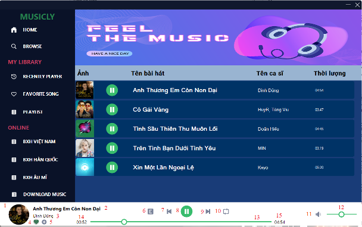

# Media Player Window

## Introduction
Media Player Window is an app for listening and download songs free from [Nhaccuatui.com](https://www.nhaccuatui.com/)

## Technologies Used
Media Player Window use the following technologies, frameworks and development techniques:

- Platform: .Net FrameWork, version 4.7.2
- Language: C#
- UI Framework: Winform
- UI design tool: Guna

## Features
A few of the things you can do with Media Player Window:

- Listen song from device
- Watch the rankings from source [Nhaccuatui.com](https://www.nhaccuatui.com/) and listen those songs 
- Download song free from [Nhaccuatui.com](https://www.nhaccuatui.com/)

## UI 

